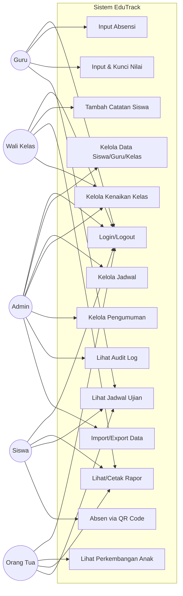

# Use Case Diagram

```mermaid
flowchart LR
  Admin((Admin))
  Guru((Guru))
  Wali((Wali Kelas))
  Siswa((Siswa))
  Ortu((Orang Tua))

  subgraph Sistem EduTrack
    UC1[Login/Logout]
    UC2[Kelola Data Siswa/Guru/Kelas]
    UC3[Kelola Jadwal]
    UC4[Input Absensi]
    UC5[Input & Kunci Nilai]
    UC6[Kelola Kenaikan Kelas]
    UC7[Lihat/Cetak Rapor]
    UC8[Kelola Pengumuman]
    UC9[Lihat Jadwal Ujian]
    UC10[Tambah Catatan Siswa]
    UC11[Lihat Perkembangan Anak]
    UC12[Absen via QR Code]
    UC13[Lihat Audit Log]
    UC14[Import/Export Data]
  end

  Admin --> UC1
  Admin --> UC2
  Admin --> UC3
  Admin --> UC6
  Admin --> UC8
  Admin --> UC13
  Admin --> UC14

  Guru --> UC1
  Guru --> UC4
  Guru --> UC5
  Guru --> UC9

  Wali --> UC1
  Wali --> UC10
  Wali --> UC7
  Wali --> UC6

  Siswa --> UC1
  Siswa --> UC7
  Siswa --> UC9
  Siswa --> UC12

  Ortu --> UC1
  Ortu --> UC11
  Ortu --> UC7
  Ortu --> UC9
```
