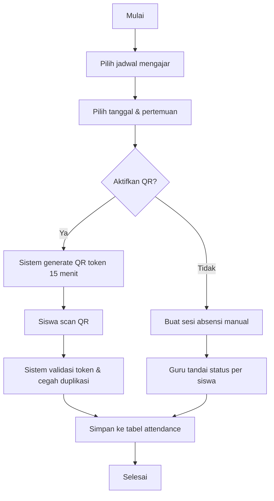
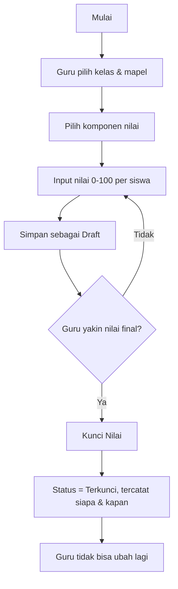
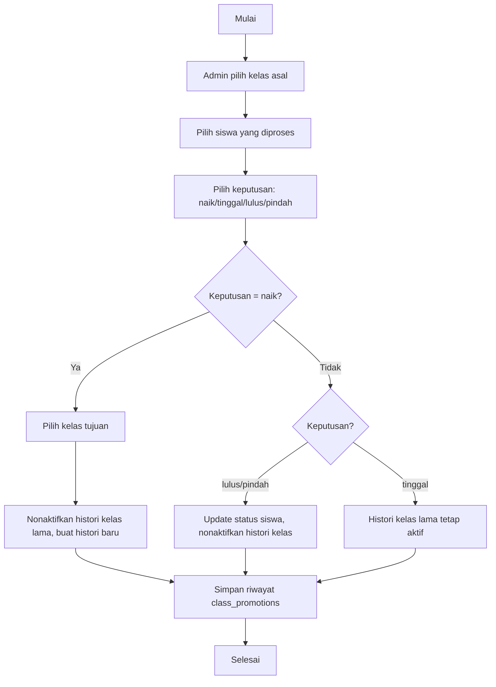
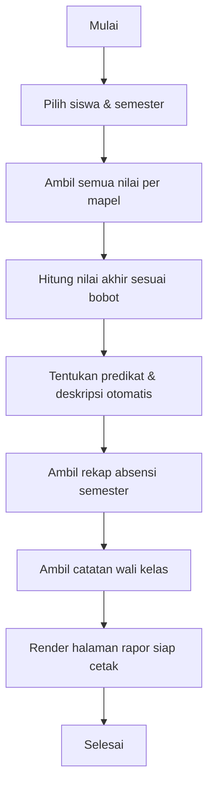
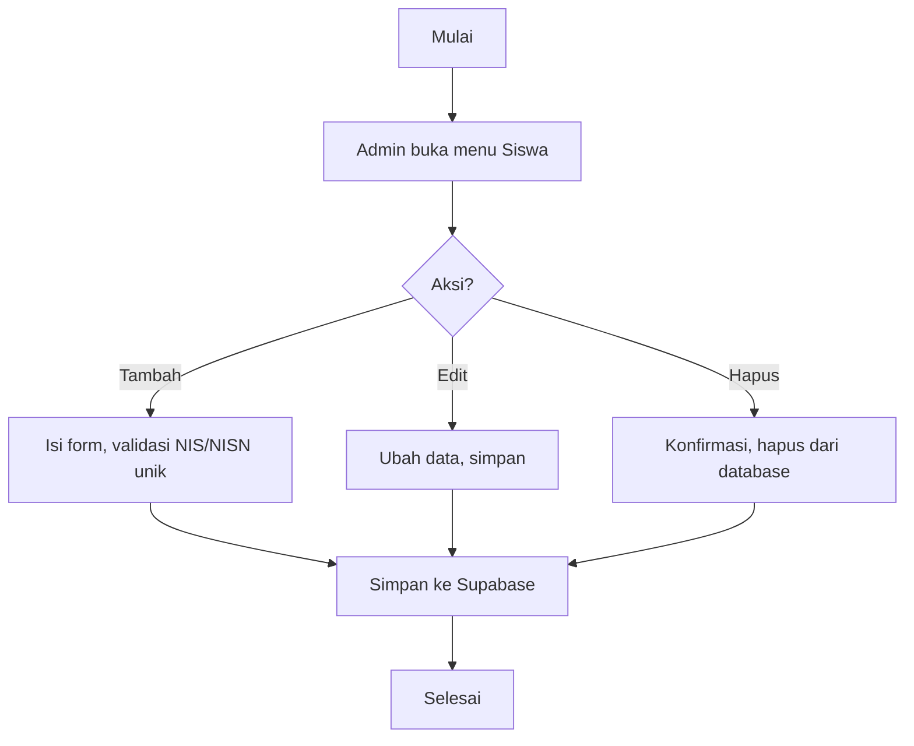
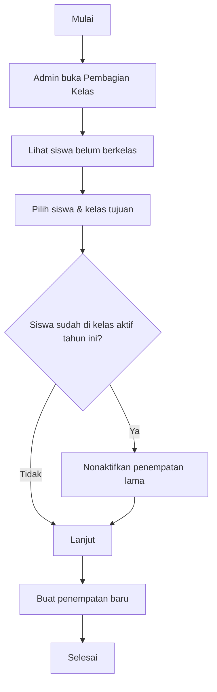

# Activity Diagrams

## Login
```mermaid
flowchart TD
  A[Mulai] --> B[Buka halaman /login]
  B --> C[Input email & password]
  C --> D{Kredensial valid?}
  D -- Tidak --> E[Tampilkan pesan error]
  E --> C
  D -- Ya --> F[Ambil profil dari tabel profiles]
  F --> G{Role?}
  G -- admin --> H1[/admin/dashboard]
  G -- teacher --> H2[/teacher/dashboard]
  G -- homeroom --> H3[/homeroom/dashboard]
  G -- student --> H4[/student/dashboard]
  G -- parent --> H5[/parent/dashboard]
```

## Input Absensi (Guru)


## Input & Kunci Nilai


## Kenaikan Kelas


## Rapor


## Mengelola Siswa


## Pembagian Kelas

