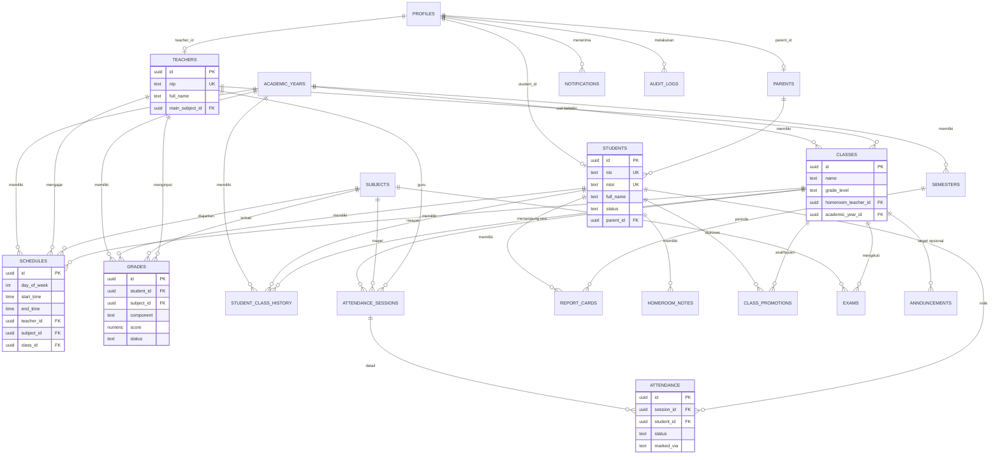

# Entity Relationship Diagram (ERD)

Sesuai dengan skema di `supabase/migrations/001_schema.sql`.

```mermaid
erDiagram
  PROFILES ||--o| TEACHERS : "teacher_id"
  PROFILES ||--o| STUDENTS : "student_id"
  PROFILES ||--o| PARENTS : "parent_id"

  PARENTS ||--o{ STUDENTS : "memiliki"
  ACADEMIC_YEARS ||--o{ SEMESTERS : "memiliki"
  ACADEMIC_YEARS ||--o{ CLASSES : "memiliki"
  ACADEMIC_YEARS ||--o{ SCHEDULES : "memiliki"
  ACADEMIC_YEARS ||--o{ GRADES : "memiliki"
  ACADEMIC_YEARS ||--o{ STUDENT_CLASS_HISTORY : "memiliki"

  TEACHERS ||--o{ CLASSES : "wali kelas"
  TEACHERS ||--o{ SCHEDULES : "mengajar"
  SUBJECTS ||--o{ SCHEDULES : "diajarkan"
  CLASSES ||--o{ SCHEDULES : "memiliki"

  STUDENTS ||--o{ STUDENT_CLASS_HISTORY : "riwayat"
  CLASSES ||--o{ STUDENT_CLASS_HISTORY : "menampung"

  CLASSES ||--o{ ATTENDANCE_SESSIONS : "sesi"
  SUBJECTS ||--o{ ATTENDANCE_SESSIONS : "mapel"
  TEACHERS ||--o{ ATTENDANCE_SESSIONS : "guru"
  ATTENDANCE_SESSIONS ||--o{ ATTENDANCE : "detail"
  STUDENTS ||--o{ ATTENDANCE : "milik"

  STUDENTS ||--o{ GRADES : "memiliki"
  SUBJECTS ||--o{ GRADES : "terkait"
  TEACHERS ||--o{ GRADES : "menginput"

  STUDENTS ||--o{ REPORT_CARDS : "memiliki"
  SEMESTERS ||--o{ REPORT_CARDS : "periode"
  STUDENTS ||--o{ HOMEROOM_NOTES : "memiliki"

  STUDENTS ||--o{ CLASS_PROMOTIONS : "diproses"
  CLASSES ||--o{ CLASS_PROMOTIONS : "asal/tujuan"

  SUBJECTS ||--o{ EXAMS : "diujikan"
  CLASSES ||--o{ EXAMS : "mengikuti"

  CLASSES ||--o{ ANNOUNCEMENTS : "target opsional"
  PROFILES ||--o{ NOTIFICATIONS : "menerima"
  PROFILES ||--o{ AUDIT_LOGS : "melakukan"

  STUDENTS {
    uuid id PK
    text nis UK
    text nisn UK
    text full_name
    text status
    uuid parent_id FK
  }
  TEACHERS {
    uuid id PK
    text nip UK
    text full_name
    uuid main_subject_id FK
  }
  CLASSES {
    uuid id PK
    text name
    text grade_level
    uuid homeroom_teacher_id FK
    uuid academic_year_id FK
  }
  SCHEDULES {
    uuid id PK
    int day_of_week
    time start_time
    time end_time
    uuid teacher_id FK
    uuid subject_id FK
    uuid class_id FK
  }
  GRADES {
    uuid id PK
    uuid student_id FK
    uuid subject_id FK
    text component
    numeric score
    text status
  }
  ATTENDANCE {
    uuid id PK
    uuid session_id FK
    uuid student_id FK
    text status
    text marked_via
  }
```
