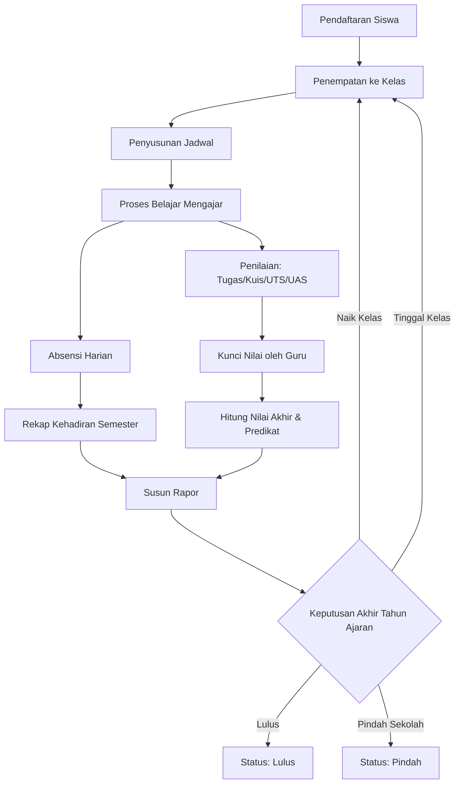

# Flowchart Alur Utama

```mermaid
flowchart TD
  A[Pendaftaran Siswa] --> B[Penempatan ke Kelas]
  B --> C[Penyusunan Jadwal]
  C --> D[Proses Belajar Mengajar]
  D --> E[Absensi Harian]
  D --> F[Penilaian: Tugas/Kuis/UTS/UAS]
  E --> G[Rekap Kehadiran Semester]
  F --> H[Kunci Nilai oleh Guru]
  H --> I[Hitung Nilai Akhir & Predikat]
  G --> J[Susun Rapor]
  I --> J
  J --> K{Keputusan Akhir Tahun Ajaran}
  K -- Naik Kelas --> B
  K -- Lulus --> L[Status: Lulus]
  K -- Tinggal Kelas --> B
  K -- Pindah Sekolah --> M[Status: Pindah]
```
