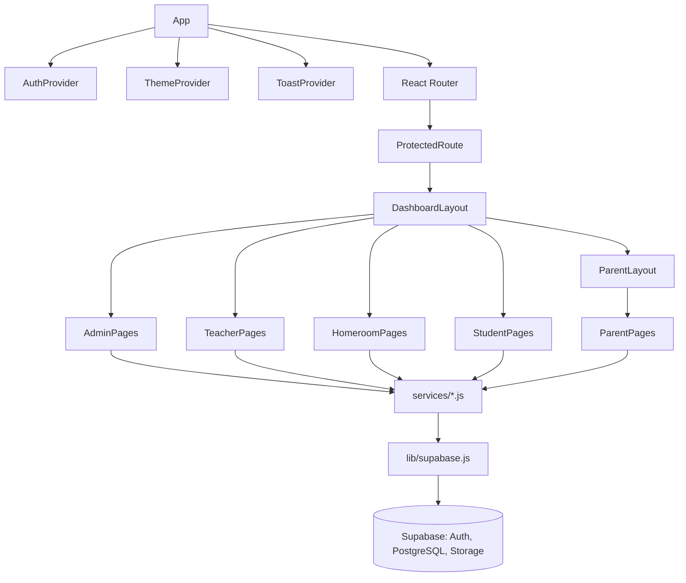

# Class / Component Diagram (Frontend)

Setiap file di `src/services/` merepresentasikan satu "domain service" yang
membungkus query Supabase untuk satu tabel/grup tabel (mis. `studentsService.js`,
`gradesService.js`), sehingga komponen halaman tidak menulis query SQL/Supabase
secara langsung — memudahkan pengujian dan pemeliharaan.
